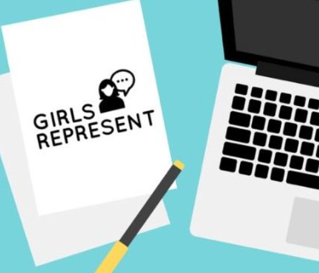

<html>
<head>
  <meta charset="utf-8"/>
  <link rel="stylesheet" href="https://maxcdn.bootstrapcdn.com/bootstrap/3.3.6/css/bootstrap.min.css" integrity="sha384-1q8mTJOASx8j1Au+a5WDVnPi2lkFfwwEAa8hDDdjZlpLegxhjVME1fgjWPGmkzs7" crossorigin="anonymous">
  <link href='https://fonts.googleapis.com/css?family=Roboto:300,400,700' rel='stylesheet' type='text/css'>
  <link rel="stylesheet" type="text/css" href="main.css">
</head>
<body>
  <header class="container">
    

      <nav class="col-sm-12 text-right">
        <a href="https://aquabs.github.io/STEM/">
Home
</a>
        <a href=" https://aquabs.github.io/STEM-events/.">
Events
</a>
        <a href="https://aquabs.github.io/STEM-news/">
News
</a>
        <a href=" https://aquabs.github.io/STEM-contacts/.">
Contact
</a>
      </nav>
    

    </header>
 <body>
   <section class="container">
     

       <nav class="col-sm-4">
         
       </nav>
       <nav class="col-sm-8">
         <h1 style="font-size:300%;">Girls Who Code</h1>
         
<i> Closing the gender gap in technology one girls at a time</i>

         
<b>Open Too:</b> Highschool Females

         
<b>Meetings:</b> Weekly Friday Room 506

         
 Girls who code is a national nonprofit organization with the mission to close the gender gap in technology. The Camas Highschool Chapter began the 2017-2018 school year, led by Monica Chang. The club focuses both on the comprehensive and application of coding, while creating a sisterhood to support one another.

         <section class="container">
     

       <nav class="col-sm-3">
         <a href="https://sites.google.com/view/camasgirlswhocode/homeabout"><button class="button button2">High School Website</button></a>
       </nav>
       <nav class="col-sm-3">
         <a href="https://girlswhocode.com/about-us/"><button class="button button2">Organization Website</button></a>
       </nav>
           

         </section>
       </nav>
     

     </section>
      
   <section class="container">
     

       <nav class="col-sm-8 text-right">
         <h1 style="font-size:300%;">DECA Girls Represent</h1>
         
<i> Campaign started by Camas DECA to advocate for female representation in nontraditional feilds</i>

         
<b>Open Too:</b> Although the maintnance and planning is limited to selected individuals, the events hosted is open to all

         
 Girls who code is a national nonprofit organization with the mission to close the gender gap in technology. The Camas Highschool Chapter began the 2017-2018 school year, led by Monica Chang. The club focuses both on the comprehensive and application of coding, while creating a sisterhood to support one another.

         <section class="container">
           

             <class="col-sm-12">
             </class>
           

         </section>
       </nav>
       <nav class="col-sm-4">
         
       </nav>
           

         </section>
     
     
     
   <footer class="container">
    

      
&copy; STEM Camas

      <ul class="col-sm-8">
        <li class="col-sm-1">   </li>
        <li class="col-sm-1">  </li>
      </ul>
    

  </footer>
